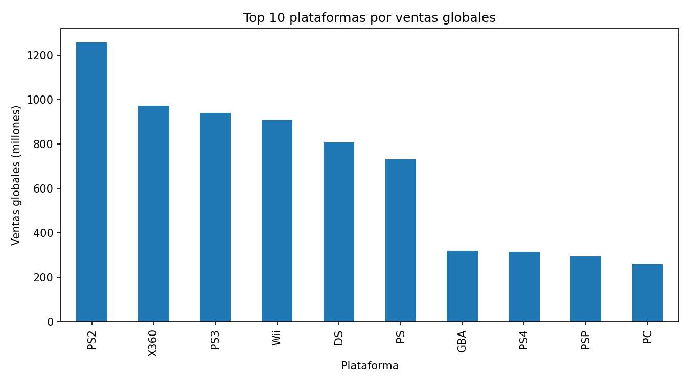
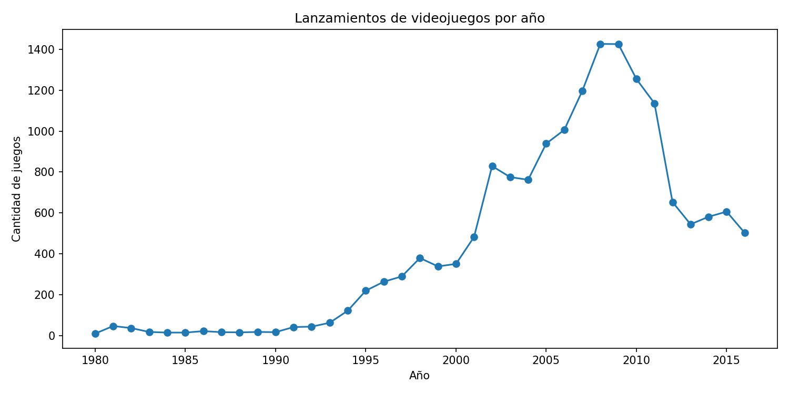
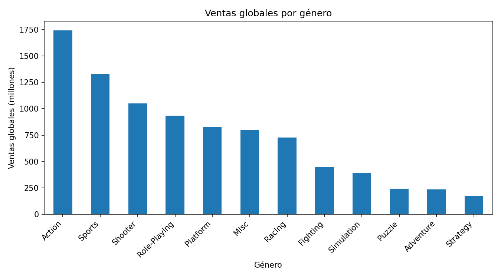

# Análisis de Ventas de Videojuegos

## Descripción del proyecto

Este proyecto analiza datos históricos de ventas de videojuegos para identificar patrones comerciales por plataforma, género, región y año de lanzamiento. El objetivo es transformar datos crudos en hallazgos útiles para apoyar decisiones de negocio relacionadas con campañas, plataformas prioritarias y comportamiento de mercado.

El análisis fue desarrollado como proyecto de formación en análisis de datos y está orientado a demostrar habilidades de limpieza, transformación, visualización, análisis estadístico y comunicación de resultados.

## Objetivo

Analizar el mercado de videojuegos para responder preguntas como:

- ¿Qué plataformas generaron mayores ventas globales?
- ¿Cómo evolucionaron los lanzamientos de videojuegos por año?
- ¿Cuáles fueron los géneros más rentables?
- ¿Qué diferencias existen entre regiones como Norteamérica, Europa y Japón?
- ¿Existe relación entre las calificaciones de usuarios/críticos y las ventas?
- ¿Las calificaciones promedio difieren entre plataformas o géneros?

## Dataset

El archivo principal es `games.csv`, que contiene **16,715 registros** y **11 columnas** con información de videojuegos, plataformas, año de lanzamiento, género, ventas regionales, calificaciones y clasificación ESRB.

Columnas principales:

- `Name`: nombre del videojuego.
- `Platform`: plataforma.
- `Year_of_Release`: año de lanzamiento.
- `Genre`: género.
- `NA_sales`, `EU_sales`, `JP_sales`, `Other_sales`: ventas por región.
- `Critic_Score`: calificación de críticos.
- `User_Score`: calificación de usuarios.
- `Rating`: clasificación ESRB.

## Herramientas utilizadas

- Python
- Pandas
- NumPy
- Matplotlib
- Seaborn
- SciPy
- Jupyter Notebook

## Estructura del repositorio

```text
ventas-videojuegos/
│
├── README.md
├── requirements.txt
├── .gitignore
│
├── data/
│   └── games.csv
│
├── notebooks/
│   └── ventas_de_videojuegos.ipynb
│
└── images/
    ├── top_10_plataformas.png
    ├── lanzamientos_por_anio.png
    └── ventas_por_genero.png
```

## Proceso de análisis

1. Carga y exploración inicial de datos.
2. Normalización de nombres de columnas.
3. Revisión y tratamiento de valores ausentes.
4. Conversión de tipos de datos.
5. Cálculo de ventas globales por videojuego.
6. Análisis de ventas por plataforma, género y región.
7. Análisis del ciclo de vida de plataformas.
8. Evaluación de correlación entre calificaciones y ventas.
9. Pruebas estadísticas de hipótesis.
10. Conclusiones generales.

## Visualizaciones destacadas

### Top 10 plataformas por ventas globales



### Lanzamientos de videojuegos por año



### Ventas globales por género



## Principales hallazgos

- Las plataformas con mayores ventas globales fueron **PS2**, **X360**, **PS3**, **Wii** y **DS**.
- Los lanzamientos de videojuegos tuvieron un fuerte crecimiento durante los años 2000 y alcanzaron su punto más alto alrededor de 2008-2009.
- Los géneros con mayores ventas globales fueron **Action**, **Sports**, **Shooter** y **Role-Playing**.
- El comportamiento regional muestra diferencias importantes: Norteamérica favorece fuertemente plataformas como Xbox 360, Europa muestra mayor presencia de PlayStation y Japón destaca por plataformas portátiles y de Nintendo.
- Las correlaciones entre calificaciones y ventas fueron positivas, pero moderadas/bajas, lo que sugiere que las ventas no dependen únicamente de las reseñas.
- En las pruebas de hipótesis se evaluaron diferencias entre plataformas y géneros usando pruebas estadísticas.

## Conclusión

El análisis muestra que las ventas de videojuegos dependen de múltiples factores: plataforma, región, género, ciclo de vida de consola y recepción del público. Este proyecto permite observar cómo el análisis de datos puede apoyar decisiones comerciales, identificar mercados clave y priorizar plataformas o géneros con mayor potencial.

## Cómo ejecutar el proyecto

1. Clonar el repositorio:

```bash
git clone https://github.com/Sustang73/ventas-videojuegos.git
```

2. Entrar a la carpeta del proyecto:

```bash
cd ventas-videojuegos
```

3. Instalar dependencias:

```bash
pip install -r requirements.txt
```

4. Abrir el notebook:

```bash
jupyter notebook notebooks/ventas_de_videojuegos.ipynb
```

## Autor

**Víctor Iván Reyes Ángeles**  
Data Analyst Junior  
LinkedIn: linkedin.com/in/victorreyes1985  
GitHub: github.com/Sustang73
